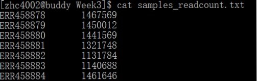

```{r setup, include=FALSE}
knitr::opts_chunk$set(echo = TRUE)
```

## Questions
###1. A somatic human cell contains about 6 picograms of DNA. How much DNA does a sperm cell contain?
3 picogram. A sperm is a progenitor of human (halpoid) so just contains half of the chromosomes (6/2 pg).

###2. How many human cells with you need to obtain 10 micrograms of DNA, as is requested by many sequencing protocols?
Need 1666667 cells. As in question 1 saying that a human somatic cell contain 6 picograms of DNA, we have to provide 10e6 / 6 = 1666666.7 cells.

###3. Describe one typical cause for DNA loss during DNA extraction.
That could be DNA still remains on the solid absorber whthin the column after buffer washing.

###4. Describe two functions of the adapters that are typically added during Illumina's library preparations. Which types of sequences do they often entails?
1. Necessary for template DNA to be immobilized on the lane whthin a sequencer and then initializes the first round of sequencing (a pcr step before bridge pcr).

2. Necessary for the newly synthesized complemetary DNA to fold over into a bridge-like shape to initialize bridge pcr.

They often have 
a) P5 and P7, which are necessary for template DNA to bind and initializing bridge pcr
b) adapter trimming sequence, which would be used to ensure unidirection sequencing, and convenient for data preprocessing and quality control
c) indices and primers for indices
d) primers for insertional DNA sequencing

### 5. Components of what kind of lab equipment have to be integrated in any type of Illumina sequencer?
a. agarose gel
I think it is included for determine the initial concentration (or amount) of the DNA samples by electrophoresis to check if the samples are enough for sequencing.

b. centrifuge
Better included for vortex of samples.

c. microscope
Not sure but may be needed for better detection in base calling process.


##Exercises
###1. Write a for-loop to download all fastq files of WT biological replicate No. 2 of the Gierlinski data set. Try to have a solution as generally applicable as possible.
On the first glance to the mapping file, we notice that the website just provides the first 50 rows of them and find no WT with 2 bioreplicates, so we should download the whole file and use unix to check samples that satisfy the conditions and extract them from it, store into a new file. Then we also need to download the summary TEXT for tracking the fastq files' urls and we can save only the address into another new file as well. At last track the addresses according to the file containing sample names and download them.

a. Login server and create new directory  
`cd /anthena/scratch/zhc4002/angsd`  
`mkdir HW3`  
`cd HW3`  

b. Download summary TEXT for tracking urls. The file name is **PRJEB5348.txt**  
`wget --content-disposition "https://www.ebi.ac.uk/ena/portal/api/filereport?accession=PRJEB5348&result=read_run&fields=study_accession,sample_accession,experiment_accession,run_accession,tax_id,scientific_name,fastq_ftp,submitted_ftp,sra_ftp&format=tsv&download=true"` 
--content-disposition added to bypass response to the website when downloading

c. Download mapping information for selecting the right samples and rename the file as **mapping.tsv**
`wget -c https://ndownloader.figshare.com/files/2194841 -O mapping.tsv`  

d. Use regular expression to select the sample names and store them into a new file called **WT_no2.txt**  
`egrep '.*WT.*[[:space:]]2$' mapping.tsv | grep -o 'ERR[0-9]* > WT_no2.txt`  

e. Select all the **.fastq.qz** files in the summary TEXT for convenience and store them in to file **address.txt**  
`egrep -o 'ftp.*\.fastq\.gz' PRJEB5348.txt > address.txt'`  

f. Extract right urls and download fastq files  
`samples=$(cat WT_no2.txt)`  
`for name in ${samples};`  
`do url=$(egrep "${name}" address.txt);`  
`wget ${url};`  
`done`  

###2. Why are there multiple fastq files per sample? What does each file represent?
They are technical replicates instead of biological replicates, and each file represent a single running process in a sequencing machine. Those replicates can be used for strict quality control.


###3. Count the number of reads stored in each FASTQ file and keep a note of the results. The zcat command allows you to see the contents of a gzipped file.
a. Create a bash script file **extract_readcount.sh** to extract number of reads in each file

```{}
samples=$(cat WT_no2.txt)

for name in ${samples}
do
length=$(zcat ${name}.fastq.gz | wc -l)
echo $((${length}/4))
done
```

b. Then run the script file and store the results in file **readcount_result.txt**  
`sh extract_readcount.sh > readout_result.txt`  

c. Paste the readcounts with their corresponding file names and store into a new file **samples_readcount.txt**  
`paste WT_no2.txt readcount_result.txt > samples_readcount.txt`  

d. The content of **samples_readcount.txt** looks like this:  



##Project
###1. Identify and write down one or two biological or technical questions of interest for your project.
How many ratio of cases in cancer are caused by or contain gene fusion? This could be focus on only one database for one or more kinds of cancer, or just one kind of cancer but across different databases.


